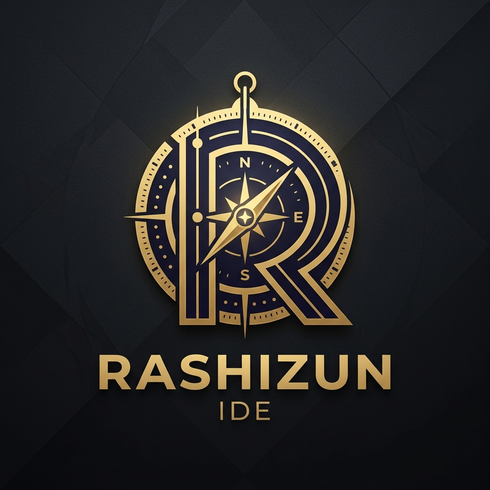

# 🗺️ Rashizun IDE Onboarding Guide

Welcome to Rashizun, the rightly guided development orchestrator. This guide will help you set up your environment, discover key features, and start building.

---

## 🏁 Quick Start

1.  **Initialize the Stack**:
    `./scripts/setup-docker.sh build`
2.  **Start Services**:
    `./scripts/setup-docker.sh up`
3.  **Access the IDE**:
    Open `http://localhost:7243` in your browser.

---

## 🚀 Key Features to Explore

### 1. The Feature Dashboard
Open [DASHBOARD.md](DASHBOARD.md) in the IDE. This is your central hub for:
- Monitoring service health.
- Applying system patches.
- Running security audits.

### 2. Multi-Architecture Support
Rashizun is built to run anywhere. You can build for specific platforms:
`./scripts/setup-docker.sh build linux/arm64`

### 3. AI Intelligence (RAG & Skills)
The IDE comes pre-integrated with a RAG engine for deep code understanding and a Skills Registry for agentic capabilities.
- **RAG Engine**: `http://localhost:7200`
- **Skills Registry**: `http://localhost:7201`

---

## 🛡️ Security & Maintenance

- **Security Audits**: Run `./scripts/security-audit.sh` to generate a vulnerability report.
- **Project Ledger**: All major architectural decisions are tracked in `.rashizun/ledger.json`.
- **Patches**: Manage system modifications via the `patches/` directory.

---

## ❓ Troubleshooting & Support

- **Logs**: Run `./scripts/setup-docker.sh logs` to see real-time output from all services.
- **Reset**: To completely reset the environment:
  `./scripts/setup-docker.sh down -v`
- **Documentation**: Visit the [docs/](docs/) directory for detailed technical internals and specifications.

---

> "Guidance is not just a destination, but a methodology." - Rashizun Project
